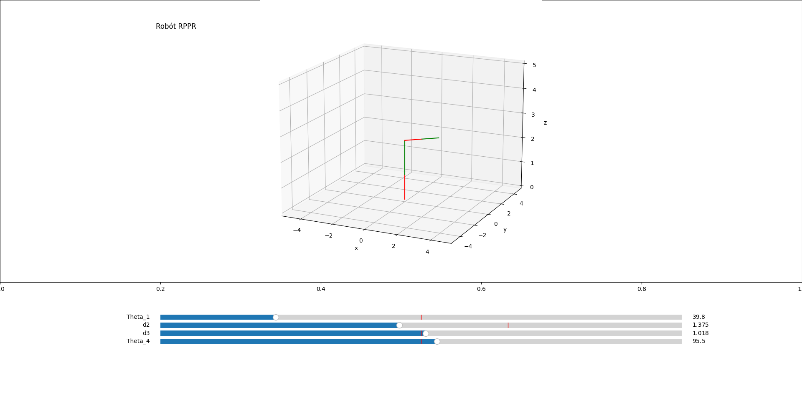

# RPPR Robot Motion Simulation

Motion simulation of a RPPR Robot using direct kinematics. 4 DOF can be manipulated.

## Requirements

This module requires the following modules:
- [Numpy](https://numpy.org/)
- [Matplotlib](https://matplotlib.org/)